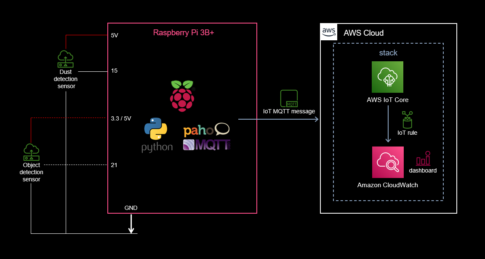
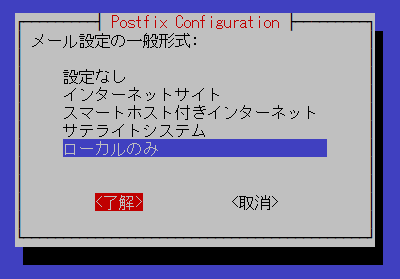

# System-to-watch-over-cats-with-a-raspberrypi
It is a self-made system that watches the daily life of remote families and cats with Raspberry Pi, cheap sensor and AWS.　(日本語名：ニャンコ見守りシステムプラス)
<br>

## **What can be done**
The movement and dustiness (pm2.5 count) of people and pets in the installed room are displayed on the web screen at 10-minute intervals.  

It can be used with the camera-system by deploying "Camera-to-watch-over-cats-with-a-raspberrypi".  

When used together, the deployment order is "System-to-watch-over-cats-with-a-raspberrypi"-> "Camera-to-watch-over-cats-with-a-raspberrypi"  

Data is not saved in DB
<br>
<br>

## **Architecture**
<br />

<br />
<br />

## **Web screen view sample**
<br />

<br />
<br />

## **Physical specifications**
### **Sensor**

For detection of objects such as people：  
* E18-D80NK  (datasheet: ./pdf/e18-d80nk.pdf)  
* HC-SR501  (datasheet: ./pdf/HC-SR501.pdf)  
<br>

For detection of dust：  
* Particle Sensor Model PPD42NS  (datasheet: ./pdf/PPD42NS.pdf)
<br>

#### **RaspberryPi**
Hardware: aarch64
Model: Raspberry Pi 4 Model B Rev 1.2
microSD card: 32GB or more
<br>
<br />

## **Development environment**
#### **RaspberryPi**
Kernel: Linux
Kernel release No.: 5.10.92-v8+
Kernel version: #1514 SMP PREEMPT Mon Jan 17 17:39:38 GMT 2022 aarch64
OS： Raspbian GNU/Linux 11 (bullseye)
Language: python 3.9.2
#### **Windows**
Editor: VSCode  
VSCode expantions: Python、Pylance、MagicPython、GitLens、Git Histry、Git Graph、Markdown All in One、Excel to Markdown table  
SCP client: WinSCP ver. 5.19  
SSH terminal client: TeraTerm ver. 4.105  
<br>
<br>

## **Construction procedure**
<br>

### **Preparation**
1.  Prepare RaspberryPi OS image disc.  https://www.raspberrypi.com/software/
2.  Prepare an aws account.
3.  Prepare IAM user with 5 custom managed policies of ./user_policy and AWSIoTFullAccess attached, or IAM user with administrator authority attached so that both console login and access key can be used.  You must replace "accountID" to your accountID in 5 policies.
4. Download access key ID and secret access key.
5. Connect the motion sensor and dust sensor (if necessary) as shown in the Architecture.
6. Insert the OS image disc into the Raspberry Pi and turn on the power.
7. Make initial settings for Raspberry Pi and connect to the Internet.
<br>
<br>

### **Building an environment on Raspberry Pi**
Launch Raspberry Pi that can connect to the Internet.  
  
  
Clone this project from public repository
```sh  
git clone https://github.com/nsaito9628/System-to-watch-over-cats-with-a-raspberrypi.git
```
  
Deploy a project  
``` sh
cp -r ./System-to-watch-over-cats-with-a-raspberrypi/src/* ~
```

Download and unpack the required packages
```sh
sudo chmod u+x environment.sh
./environment.sh
```
Postfix config chooses local setting and using the default email address.
<br />
  

<br />
<br>
<br>

Set aws configuration as default profile  
```sh
aws configure
```  
>(Replace with your own key)  
AWS Access Key ID[]: your Access Key ID  
AWS Secret Access Key []: your Secret Access Key  
Default region name []: ap-northeast-1  
Default output format []:  


Customize parameters (if needed)  
``` sh
cd cert
sudo nano iot_prov_config
```
Parameters customizable as below 
>THING NAME (same as Project Name)
TOPIC_MOTION (same as Topic1 in template.yaml)  
TOPIC_DUST (same as Topic2 in template.yaml)  
SENSOR_NO  
S3BUCKET  
  
Registration of RaspberryPi as a thing to AWS IoT core and automatic startup setting
```sh
sudo chmod u+x iot_prov.sh
./iot_prov.sh
```
  
Rewrite to your own parameters(if needed)
```sh
cd ../System-to-watch-over-cats-with-a-raspberrypi/template
```
```sh
sudo nano template.yaml
```
  
Parameters customizable as below  
>NameTag  
ProjectName (same as THING_NAME in iot_prov_config)  
Topic1 (same as TOPIC_MOTION in iot_prov_config)  
Topic2 (same as TOPIC_DUST in iot_prov_config)  
Metric1
Metric2

<br>

Deploy CloudFormation stack
```sh
sam build
sam deploy --guided --capabilities CAPABILITY_NAMED_IAM

    #Enter any stack name and [Y/N]  
        Stack Name [sam-app]: any-stack-name  
        AWS Region [ap-northeast-1]: 
        Parameter ProjectName [WatchOver]: 
        Parameter Topic1 [myroom/motion]: 
        Parameter Topic2 [myroom/dust]: 
        Parameter Metric1 [motion_count]: 
        Parameter Metric2 [dust_count]: 
        Parameter NameTag [WatchOverDashboard]: 
        #Shows you resources changes to be deployed and require a 'Y' to initiate deploy
        Confirm changes before deploy [Y/n]: Y
        #SAM needs permission to be able to create roles to connect to the resources in your template
        Allow SAM CLI IAM role creation [Y/n]: Y
        #Preserves the state of previously provisioned resources when an operation fails
        Disable rollback [Y/n]: Y
        Save arguments to configuration file [Y/n]: Y
        SAM configuration file [samconfig.toml]: 
        SAM configuration environment [default]: 
        ・  
        ・  
        ・  
        Deploy this changeset? [y/N]: y
```
Confirm message like "Successfully created/updated stack - any-stack-name in ap-northeast-1"  
  
Restart Raspberry Pi
```sh
sudo reboot   
```
<br>

## **Utilization in living space** ##

From the IAM user's management console, go to CloudWatch> Dashboards> WatchOver Dashboard (Your Dashboard) and see the signal from the Raspberry Pi.
